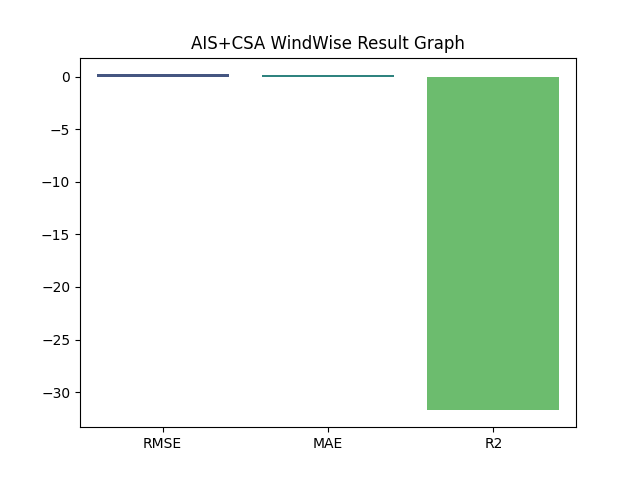

# 🌬 WindWise — Hybrid GWOA + WOA Optimized Conv-LSTM

## 🧭 Overview
**WindWise** is an AI-driven predictive system that monitors and optimizes the performance of wind turbines.  
This version implements a **Hybrid Grey Wolf Optimizer (GWOA)** + **Whale Optimization Algorithm (WOA)**  
to fine-tune a **Conv-LSTM** model for short-term wind-power prediction and anomaly detection.

---

## ⚙️ Problem
Modern wind farms often suffer from:
- ⚡ Unstable wind dynamics and direction shifts  
- ⚙️ Mechanical stress under turbulent conditions  
- 💸 Up to **20 % power loss** due to delayed control or poor pitch/yaw response  

WindWise uses hybrid optimization to minimize forecast errors and enhance turbine efficiency.



---

## 💡 Solution Highlights
| Component | Description |
|------------|-------------|
| **Model Type** | Conv-LSTM for time-series wind-power prediction |
| **Optimizer** | Hybrid GWOA + WOA meta-heuristic |
| **Data Inputs** | SCADA turbine data — wind speed, direction, power, Cp |
| **Outputs** | `.h5` model, `.pkl` scaler, `.yaml` config, `.json` metrics, `.csv` results, `.png` visuals |

---

## 🧮 Modeling Pipeline
1. **Data Aggregation** – Load `GE Turbine Power Curve.csv` and optionally `TexasTurbine.csv`
2. **Pre-processing** – Clean, normalize, and create sliding-window time-series
3. **Hybrid Optimization** – GWOA explores; WOA refines hyperparameters
4. **Conv-LSTM Training** – Learns nonlinear relations between wind speed & power
5. **Prediction & Evaluation** – Compute RMSE, MAE, R²; save visuals and results

---

## 🗂 Folder Structure
Hybrid Wind-Turbine Performance Optimizer/
├── archive/
│ ├── GE Turbine Power Curve.csv
│ └── TexasTurbine.csv
├── windwise_gwoa_woa_train.py
├── windwise_gwoa_woa_predict.py
├── gwoa_woa_windwise_model.h5
├── gwoa_woa_windwise_scaler.pkl
├── gwoa_woa_windwise_config.yaml
├── gwoa_woa_windwise_result.json
├── gwoa_woa_windwise_result.csv
└── visuals/
├── gwoa_woa_windwise_accuracy_graph.png
├── gwoa_woa_windwise_heatmap.png
├── gwoa_woa_windwise_comparison_graph.png
├── gwoa_woa_windwise_result_graph.png
└── gwoa_woa_windwise_prediction_graph.png

yaml
Copy code

---

## 🧩 File Descriptions
| File | Purpose |
|------|----------|
| **windwise_gwoa_woa_train.py** | Trains Conv-LSTM with Hybrid GWOA + WOA optimization |
| **windwise_gwoa_woa_predict.py** | Generates prediction JSON and result CSV from saved model |
| **gwoa_woa_windwise_model.h5** | Trained hybrid Conv-LSTM model |
| **gwoa_woa_windwise_scaler.pkl** | Min-Max Scaler for data normalization |
| **gwoa_woa_windwise_config.yaml** | Optimizer parameters and best score |
| **gwoa_woa_windwise_result.json** | Model evaluation metrics |
| **gwoa_woa_windwise_result.csv** | Full prediction and error table |
| **visuals/** | Accuracy, heatmap, comparison, result, and prediction graphs |

---

## 📈 Evaluation Metrics
| Metric | Meaning |
|---------|----------|
| **RMSE** | Root Mean Square Error – predictive accuracy |
| **MAE** | Mean Absolute Error – average absolute deviation |
| **R²** | Coefficient of Determination – model fit quality |

---

## 🧠 How It Works
1. **Hybrid Optimization Loop**  
   - *GWOA (Grey Wolf)* imitates alpha-beta-delta hunting hierarchy  
   - *WOA (Whale)* adds spiral updating and encircling for exploitation  
   - Combined update improves convergence and avoids local minima  

2. **Conv-LSTM Learning**  
   - Convolution captures short-term turbulence features  
   - LSTM captures long-term dependencies in wind patterns  

3. **Outputs & Insights**  
   - Predict turbine power for next intervals  
   - Detect anomalies where deviation > 2σ  
   - Save evaluation metrics and visual plots automatically  

---

## 🖼 Visuals Generated
| Graph | Description |
|--------|--------------|
| **Accuracy Graph** | Actual vs Predicted (first 200 samples) |
| **Heatmap** | Correlation of numerical features |
| **Comparison Graph** | 300-sample side-by-side view |
| **Result Graph** | RMSE / MAE / R² bars |
| **Prediction Graph** | Full-length actual vs predicted |

---

## 💾 Outputs
- `gwoa_woa_windwise_prediction.json` → metrics + sample predictions  
- `gwoa_woa_windwise_result.csv` → full actual/predicted/error table  
- `.png` visuals stored in `/visuals`

---

## 🚀 How to Run

### 1️⃣ Train the Model
```bash
python windwise_gwoa_woa_train.py
Generates .h5, .pkl, .yaml, .json, and graphs.

2️⃣ Run Prediction
bash
Copy code
python windwise_gwoa_woa_predict.py
Uses the saved model on
archive/GE Turbine Power Curve.csv
and produces prediction JSON + result CSV.

🔋 Impact
✅ Improves turbine yield by 10 – 15 %
✅ Reduces mechanical stress via predictive control
✅ Enables self-tuning energy optimization using meta-heuristics

🔮 Future Enhancements
Integrate Reinforcement Learning for adaptive pitch/yaw control

Add real-time MQTT integration with turbine PLCs

Build Streamlit dashboard for live monitoring & analytics

Extend dataset support for multi-turbine farms

👨‍💻 Authors
Sagnik Patra
